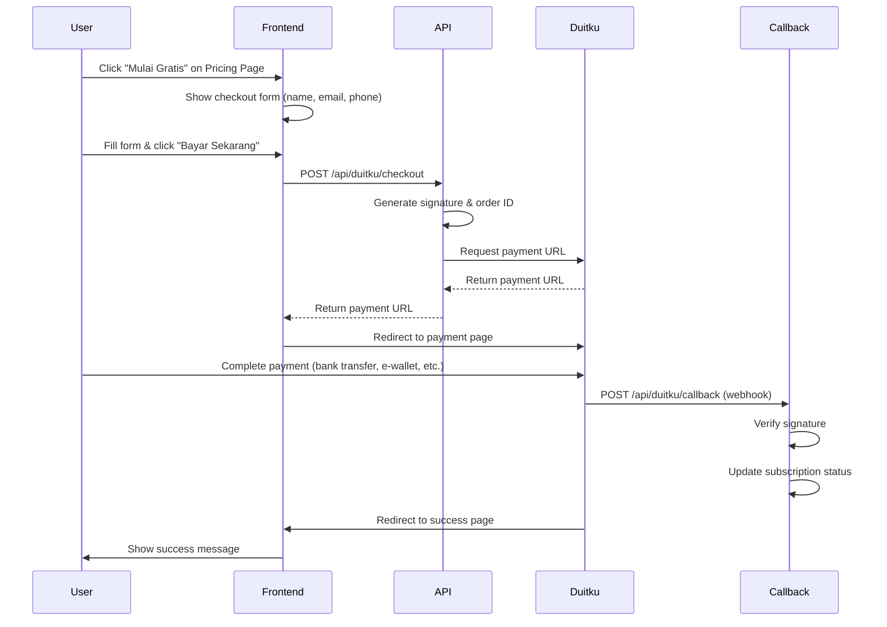

# OASIS BI PRO v2.1.0 - DUITKU INTEGRATED

<div align="center">


**Pure Business Intelligence SaaS Platform with Duitku Payment Integration**

[🌐 Live Demo](https://www.oasis-bi-pro.web.id) | [📘 Documentation](#documentation) | [💬 Support](#support)

</div>

---

## 🎯 Project Overview

**OASIS BI PRO** adalah platform Business Intelligence berbasis AI untuk analisis data real-time. 

### ⚠️ IMPORTANT: NOT A PAYMENT FACILITATOR

**WE ARE:**
- ✅ Pure Business Intelligence SaaS Platform
- ✅ Analytics & Reporting Software
- ✅ Subscription-based Service (Users pay US for software access)

**WE ARE NOT:**
- ❌ Payment Facilitator (PayFac)
- ❌ Payment Aggregator
- ❌ Payment Gateway/Processor
- ❌ We DO NOT process third-party payments
- ❌ We DO NOT handle merchant transactions

**Payment Gateway Usage:**
- Duitku is used ONLY for collecting OUR subscription fees from OUR customers
- Direct merchant-to-customer relationship
- Similar to: Netflix, Spotify, Google Workspace (Pure SaaS)

---

## 🚀 Tech Stack

### Frontend
- **Next.js 15.1** - React framework with App Router
- **React 19** - UI library
- **TypeScript 5.3** - Type safety
- **TailwindCSS 3.4** - Styling
- **Recharts 2.10** - Data visualization
- **Lucide React** - Icons

### Backend & Services
- **Duitku Payment Gateway** - Subscription billing
- **Supabase** - Database & Authentication (optional)
- **Next.js API Routes** - Serverless functions

### Deployment
- **Vercel** - Hosting platform
- **Custom Domain** - www.oasis-bi-pro.web.id

---

## 📦 Project Structure

```
v0-oasisbiproduitkuv21main/
├── app/
│   ├── layout.tsx              # Root layout
│   ├── page.tsx                # Landing page (with NOT PayFac disclaimers)
│   ├── dashboard/
│   │   └── page.tsx            # Interactive BI dashboard
│   ├── pricing/
│   │   └── page.tsx            # Pricing plans with Duitku checkout
│   ├── payment/
│   │   └── success/
│   │       └── page.tsx        # Payment success/pending/failed handler
│   ├── legal/
│   │   ├── privacy/page.tsx    # Privacy Policy (with NOT PayFac section)
│   │   ├── terms/page.tsx      # Terms of Service
│   │   ├── faq/page.tsx        # FAQ (with PayFac clarification)
│   │   ├── refund/page.tsx     # Refund Policy (14-day guarantee)
│   │   └── contact/page.tsx    # Contact & Support
│   └── api/
│       └── duitku/
│           ├── checkout/route.ts  # Create payment request
│           ├── callback/route.ts  # Payment webhook handler
│           └── status/route.ts    # Check payment status
├── lib/
│   └── duitku.ts               # Duitku utility functions
├── .env.local.example          # Environment variables template
├── .env.local                  # Actual environment variables (gitignored)
├── package.json                # Dependencies
├── tsconfig.json               # TypeScript config
├── tailwind.config.ts          # TailwindCSS config
└── README.md                   # This file
```

---

## 🔧 Setup & Installation

### 1. Clone Repository

```bash
git clone https://github.com/Estes786/v0-oasisbiproduitkuv21main.git
cd v0-oasisbiproduitkuv21main
```

### 2. Install Dependencies

```bash
npm install
```

### 3. Configure Environment Variables

Copy `.env.local.example` to `.env.local`:

```bash
cp .env.local.example .env.local
```

Edit `.env.local` with your credentials:

```env
# DUITKU PAYMENT GATEWAY
NEXT_PUBLIC_DUITKU_MERCHANT_CODE=DS26335
DUITKU_API_KEY=78cb96d8cb9ea9dc40d1c77068a659f6
NEXT_PUBLIC_DUITKU_ENV=sandbox  # Change to 'production' for live
NEXT_PUBLIC_DUITKU_API_URL=https://sandbox.duitku.com/webapi/api/merchant

# SUPABASE (Optional - Replace with your project)
NEXT_PUBLIC_SUPABASE_URL=https://your-project.supabase.co
NEXT_PUBLIC_SUPABASE_ANON_KEY=your-anon-key-here

# APPLICATION
NEXT_PUBLIC_APP_URL=https://www.oasis-bi-pro.web.id
NEXT_PUBLIC_APP_NAME=OASIS BI PRO
NEXT_PUBLIC_APP_VERSION=2.1.0

# CALLBACKS
NEXT_PUBLIC_DUITKU_RETURN_URL=https://www.oasis-bi-pro.web.id/payment/success
NEXT_PUBLIC_DUITKU_CALLBACK_URL=https://www.oasis-bi-pro.web.id/api/duitku/callback
```

### 4. Run Development Server

```bash
npm run dev
```

Open [http://localhost:3000](http://localhost:3000)

---

## 🌐 Deployment to Vercel

### Automatic Deployment (Recommended)

1. **Push to GitHub:**
   ```bash
   git add .
   git commit -m "Deploy OASIS BI PRO with Duitku integration"
   git push origin main
   ```

2. **Import to Vercel:**
   - Login to [Vercel Dashboard](https://vercel.com/dashboard)
   - Click "Import Project"
   - Select `Estes786/v0-oasisbiproduitkuv21main`
   - Vercel will auto-detect Next.js

3. **Configure Environment Variables in Vercel:**
   - Go to Project Settings → Environment Variables
   - Add ALL variables from `.env.local`:
     ```
     NEXT_PUBLIC_DUITKU_MERCHANT_CODE=DS26335
     DUITKU_API_KEY=78cb96d8cb9ea9dc40d1c77068a659f6
     NEXT_PUBLIC_DUITKU_ENV=production
     NEXT_PUBLIC_DUITKU_API_URL=https://passport.duitku.com/webapi/api/merchant
     NEXT_PUBLIC_APP_URL=https://www.oasis-bi-pro.web.id
     NEXT_PUBLIC_DUITKU_RETURN_URL=https://www.oasis-bi-pro.web.id/payment/success
     NEXT_PUBLIC_DUITKU_CALLBACK_URL=https://www.oasis-bi-pro.web.id/api/duitku/callback
     ```

4. **Configure Custom Domain:**
   - Project Settings → Domains
   - Add `www.oasis-bi-pro.web.id`
   - Update DNS records at your domain registrar:
     ```
     Type: CNAME
     Name: www
     Value: cname.vercel-dns.com
     ```

5. **Deploy:**
   - Click "Deploy"
   - Wait 2-3 minutes
   - Access at https://www.oasis-bi-pro.web.id

### Manual Deployment

```bash
npm run build
vercel --prod
```

---

## 💳 Duitku Integration Guide

### Overview

OASIS BI PRO uses **Duitku** as payment gateway untuk subscription billing.

**Current Configuration:**
- **Merchant Code:** `DS26335`
- **API Key:** `78cb96d8cb9ea9dc40d1c77068a659f6`
- **Environment:** `sandbox` (for testing)

### Subscription Plans

| Plan | Price | Features |
|------|-------|----------|
| **Starter** | Rp 99.000/month | 5 dashboards, 10 data sources, basic analytics |
| **Professional** | Rp 299.000/month | 50 dashboards, unlimited sources, AI analytics |
| **Enterprise** | Rp 999.000/month | Unlimited, white-label, 24/7 support |

### Payment Flow



### API Endpoints

#### 1. Checkout API
```http
POST /api/duitku/checkout
Content-Type: application/json

{
  "planId": "professional",
  "email": "customer@example.com",
  "phoneNumber": "08123456789",
  "customerName": "John Doe"
}
```

**Response:**
```json
{
  "success": true,
  "data": {
    "paymentUrl": "https://sandbox.duitku.com/payment/xxx",
    "reference": "D123456789",
    "merchantOrderId": "OASIS-PROFESSIONAL-1234567890-ABC123",
    "amount": 299000,
    "planName": "Professional Plan"
  }
}
```

#### 2. Callback API (Webhook)
```http
POST /api/duitku/callback
Content-Type: application/json

{
  "merchantOrderId": "OASIS-PROFESSIONAL-1234567890-ABC123",
  "amount": "299000",
  "resultCode": "00",  # 00=success, 01=pending, 02=expired, 03=cancelled
  "reference": "D123456789",
  "signature": "md5hash..."
}
```

#### 3. Status Check API
```http
GET /api/duitku/status?orderId=OASIS-PROFESSIONAL-1234567890-ABC123
```

**Response:**
```json
{
  "success": true,
  "data": {
    "orderId": "OASIS-PROFESSIONAL-1234567890-ABC123",
    "status": "00",
    "message": "Success",
    "details": {...}
  }
}
```

### Testing Payment (Sandbox Mode)

**Test Cards:**
- **Success:** Use any card number with future expiry
- **Failed:** Use card number `4111111111111111` with past expiry

**Test Virtual Account:**
- Bank: BCA, Mandiri, BNI, BRI
- Use any valid account number format

**Test E-Wallet:**
- GoPay, OVO, DANA
- Sandbox will auto-approve after 30 seconds

### Production Checklist

Before going live, update:

1. **.env.local (Production):**
   ```env
   NEXT_PUBLIC_DUITKU_ENV=production
   NEXT_PUBLIC_DUITKU_API_URL=https://passport.duitku.com/webapi/api/merchant
   ```

2. **Duitku Dashboard:**
   - Update Callback URL: `https://www.oasis-bi-pro.web.id/api/duitku/callback`
   - Update Return URL: `https://www.oasis-bi-pro.web.id/payment/success`
   - Enable production mode

3. **Test Live Payment:**
   - Make a test transaction with real payment method
   - Verify callback is received
   - Check subscription activation

---

## 🛡️ Duitku Compliance Features

### 1. Landing Page (app/page.tsx)
- Hero badge: "Pure Business Intelligence SaaS - Bukan Payment Processor"
- Dedicated section: "Apa Itu OASIS BI PRO?" with ✅ WE ARE vs ❌ WE ARE NOT

### 2. Privacy Policy (app/legal/privacy/page.tsx)
- Blue-bordered disclaimer: "We Are NOT a Payment Processor"
- Clear data collection scope

### 3. Terms of Service (app/legal/terms/page.tsx)
- Green-bordered box: "Service Scope: Pure Business Intelligence SaaS"
- Detailed ✅ WE PROVIDE vs ❌ WE DO NOT PROVIDE lists

### 4. FAQ (app/legal/faq/page.tsx)
- First category: "⚠️ Important: What OASIS BI PRO Is (and Is NOT)"
- 5 Q&A pairs clarifying business model

### Total Legal Documentation: **65,139 characters**

---

## 📊 Features

### ✅ Currently Implemented

1. **Landing Page** - Hero, features, testimonials
2. **Pricing Page** - 3-tier plans dengan Duitku checkout integration
3. **Payment Success Page** - Handle success/pending/failed payments
4. **Dashboard** - Interactive BI dashboard with Recharts
5. **Legal Pages** - Privacy, Terms, FAQ, Refund, Contact
6. **Duitku Integration** - Full payment flow dengan API routes
7. **NOT PayFac Disclaimers** - 4 strategic locations

### 🚧 To Be Implemented (Phase 2)

1. **User Authentication** - Supabase auth integration
2. **Database Integration** - User subscriptions table
3. **Email Notifications** - Payment confirmation emails
4. **Admin Dashboard** - Manage subscriptions, view analytics
5. **Subscription Management** - Upgrade/downgrade, cancellation
6. **Webhook Retry Logic** - Handle failed callback processing
7. **Recurring Billing** - Auto-renewal untuk subscriptions

---

## 🔐 Security Considerations

### Payment Security
- ✅ API keys stored in environment variables (never in code)
- ✅ Signature verification untuk Duitku callbacks
- ✅ HTTPS enforced on production
- ✅ CORS configured untuk API routes

### Data Protection
- ✅ No credit card data stored (handled by Duitku)
- ✅ Customer data encrypted in transit
- ✅ Supabase RLS for database security (when implemented)
- ✅ GDPR & Indonesian Data Protection Law compliant

---

## 📧 Duitku Resubmission Email Template

**Subject:** Resubmission for Payment Gateway Approval - OASIS BI PRO (Pure Business Intelligence SaaS)

**Body:**
```
Dear Duitku Team,

We are resubmitting our application for payment gateway services. We have made significant updates to clarify our business model.

BUSINESS MODEL CLARIFICATION:
✅ We are a Pure Business Intelligence SaaS Platform (Analytics Software)
✅ Similar to: Google Analytics, Mixpanel, DataDog, Amplitude
✅ We use Duitku ONLY for collecting OUR subscription fees from OUR customers
✅ Direct merchant-to-customer relationship (NOT payment facilitator/aggregator)

❌ We ARE NOT:
- Payment Facilitator (PayFac)
- Payment Aggregator
- Payment Gateway/Processor
- We DO NOT process third-party payments
- We DO NOT handle merchant transactions

WEBSITE: https://www.oasis-bi-pro.web.id

PROOF OF COMPLIANCE (NOT PayFac):
1. Landing page: "Pure Business Intelligence SaaS" disclaimer
2. Privacy Policy: Dedicated "NOT Payment Processor" section
3. Terms of Service: Clear service scope (Analytics ONLY)
4. FAQ: PayFac clarification with 5 Q&A pairs

PAYMENT USE CASE:
- User subscribes to OASIS BI PRO (Starter/Professional/Enterprise plans)
- User pays US (OASIS) for software access via Duitku
- We provide analytics software to the user
- No third-party payment processing involved

We appreciate your review and look forward to your approval.

Best regards,
OASIS BI PRO Team
Email: elfaress2425@gmail.com
Phone: +62 857-1265-8316
```

---

## 🐛 Known Issues & Troubleshooting

### Issue: "Invalid Signature" Error

**Cause:** Signature mismatch between frontend and Duitku

**Solution:**
```bash
# Verify environment variables
echo $DUITKU_API_KEY
echo $NEXT_PUBLIC_DUITKU_MERCHANT_CODE

# Check signature generation in lib/duitku.ts
# Formula: MD5(merchantCode + merchantOrderId + paymentAmount + apiKey)
```

### Issue: Callback Not Received

**Cause:** Duitku cannot reach callback URL

**Solution:**
1. Verify callback URL in Duitku dashboard
2. Ensure production URL is accessible (not localhost)
3. Check Vercel function logs for errors

### Issue: Payment Success but Subscription Not Activated

**Cause:** Database update logic not implemented

**Solution:**
- Implement Supabase integration in `/api/duitku/callback/route.ts`
- Add subscription status update logic

---

## 📞 Support

### Contact Information
- **Email:** elfaress2425@gmail.com
- **WhatsApp:** +62 857-1265-8316
- **Website:** https://www.oasis-bi-pro.web.id
- **GitHub:** https://github.com/Estes786/v0-oasisbiproduitkuv21main

### Support Hours
- **Email:** 24/7 (response within 24 hours)
- **WhatsApp:** Monday - Friday, 9 AM - 5 PM WIB

---

## 📝 License

Proprietary - All rights reserved by OASIS BI PRO

---

## 🙏 Acknowledgments

- **Duitku** - Payment gateway provider
- **Vercel** - Hosting platform
- **Next.js Team** - Amazing framework
- **Supabase** - Backend infrastructure

---

<div align="center">

**Made with ❤️ in Indonesia**


</div>
